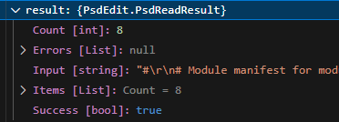
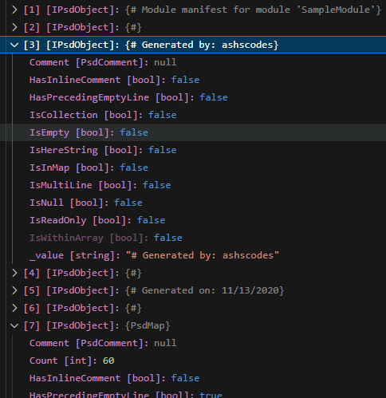
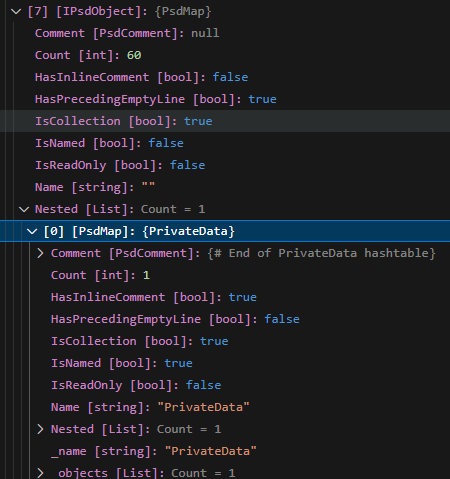

# PsdEdit

_This project is a work in progress. Check out [Usage](#usage)._

**PsdEdit** is a .NET library for reading and modifying PowerShell Manifest files (**.psd1**) without the destructive action of [`New-ModuleManifest`](https://learn.microsoft.com/en-us/powershell/module/microsoft.powershell.core/new-modulemanifest?view=powershell-7.4) or [`Update-ModuleManifest`](https://learn.microsoft.com/en-us/powershell/module/powershellget/update-modulemanifest?view=powershellget-3.x).

## Usage

Currently the writer is still being implemented, but please feel free to checkout the [Read sample here](src/PsdEdit.Sample/Program.cs) and set the debugger to stop at `var output`. Here you will be able to see a `result` object which contains the top-level statements in the **.psd** file (usually comments) and the initial hashtable or map of data under the property `Items`.





Each [`IPsdObject`](src/PsdEdit/Interfaces/IPsdObject.cs) has a number of properties that help determine what the object is, and how it was written in text within the file. In the example above, you will see the [PsdComment](src/PsdEdit/Model/Values/PsdComment.cs) value, and the [PsdMap](src/PsdEdit/Model//Objects/PsdMap.cs) collection.

Each [PsdMap](src/PsdEdit/Model//Objects/PsdMap.cs) contains a further breakdown of the items within, usually as more [PsdComments](src/PsdEdit/Model/Values/PsdComment.cs), or as a [PsdMapEntry](src/PsdEdit/Model/Objects/PsdMapEntry.cs) where the key (or Identifier) and value of any map entry can be accessed and set.

When a module contains a nested map, such as `PrivateData`, `PSData` or any custom nested named map, the parent object also includes a reference to the map directly via the `Nested` property.



### Usage In PowerShell

If you would like to load the library in PowerShell (latest version only currently - 7.4.x), you can build the project and [add the library from the bin folder](src/PsdEdit/bin/Debug/net8.0/PsdEdit.dll) in to a PowerShell session.

Full instructions.

```powershell
# Open PowerShell
git clone https://www.github.com/ashscodes/psdedit.git
cd psdedit
dotnet build src/PsdEdit/PsdEdit.csproj
Add-Type -Path src/PsdEdit/bin/Debug/net8.0/PsdEdit.dll
```

From there you can read the sample file like so:

```powershell
$Result = [PsdEdit.SystemExtensions]::ReadPsdFile((Get-Item "sample/SampleModule.psd1"))
```

Once the `$Result` variable is populated, you may wish to use `Write-Output` with the `NoEnumerate` switch parameter to stop PowerShell from writing out all the nested items too.

#### List Object Type

```powershell
# List types of items found.
$Result.Items | Select-Object @{L="Type";E={$_.GetType()}}
```

**Output:**

```
Type
----
PsdEdit.PsdComment
PsdEdit.PsdComment
PsdEdit.PsdComment
PsdEdit.PsdComment
PsdEdit.PsdComment
PsdEdit.PsdComment
PsdEdit.PsdComment
PsdEdit.PsdMap
```

#### Explore Initial Map

```powershell
# List types of items in initial map - If you use another file, the data map may be at another index than 7.
$Result.Items[7] | Select-Object Key,@{l='Value';E={$_.GetValue()}}
```

**Output:**

```
Key                  Value
---                  -----
                     # Script module or binary module file associated with this manifest.
                     # RootModule = ''
                     # Version number of this module.
ModuleVersion        '1.2.3'
                     # Supported PSEditions
CompatiblePSEditions {"Desktop", "Core"}
                     # ID used to uniquely identify this module
GUID                 '2c62f4f5-fef2-4e6a-a4bc-ffb0a0033ce3'
```

#### Convert A Comment To A MapEntry

```powershell
[PsdEdit.PsdMapEntry]$MapEntry = $null
[PsdEdit.IPsdObject]$PsdObject = $null
$Result.Items[7][1].TryGetMapEntry([ref]$MapEntry, [ref]$PsdObject)
$MapEntry | gm
```

**Output:**

```
$MapEntry | gm

   TypeName: PsdEdit.PsdMapEntry

Name                  MemberType Definition
----                  ---------- ----------
Equals                Method     bool Equals(System.Object obj)
GetHashCode           Method     int GetHashCode()
GetType               Method     type GetType()
GetValue              Method     PsdEdit.IPsdObject GetValue()
ToString              Method     string ToString()
TrySetValue           Method     bool TrySetValue(PsdEdit.IPsdObject psdObject)
Comment               Property   PsdEdit.PsdComment Comment {get;set;}
HasInlineComment      Property   bool HasInlineComment {get;}
HasPrecedingEmptyLine Property   bool HasPrecedingEmptyLine {get;set;}
IsCollection          Property   bool IsCollection {get;}
IsReadOnly            Property   bool IsReadOnly {get;}
Key                   Property   string Key {get;set;}
```

You can then set the value of the map entry.

```powershell
$MapEntry.TrySetValue([PsdEdit.PsdStringLiteral]::new("./MyModule.psm1"))
$MapEntry | select Key,@{l='Value';E={$_.GetValue()}}
```

**Output:**

```
Key        Value
---        -----
RootModule './MyModule.psm1'
```

In the future most of this won't rely on extension methods being called in PowerShell, and will move to a cmdlet form.

## PsdEdit Objects

In **PsdEdit** most objects are either a collection or a value. Exploring the types within this library will currently give an idea of what is possible until documentation is provided. Almost all objects inherit from the corresponding interfaces

- [`IPsdCollection<T>`](src/PsdEdit/Interfaces/IPsdCollectionOfT.cs)

- [`IPsdValue<T>`](src/PsdEdit/Interfaces/IPsdValueOfT.cs)

### Collection Types

- [`PsdArray`](src/PsdEdit/Model/Objects/PsdArray.cs) - Represents expandable and literal arrays.

- [`PsdKewordCollection`](src/PsdEdit/Model/Objects/PsdKeywordCollection.cs) - Represents a scriptblock of [keywords](src/PsdEdit/Model/Objects/PsdKeyword.cs).

- [`PsdMap`](src/PsdEdit/Model/Objects/PsdMap.cs) - Represents a PowerShell Object.

### Value Types

- [`PsdBoolean`](src/PsdEdit/Model/Values/PsdBoolean.cs) - Represents a PowerShell boolean value.

- [`PsdComment`](src/PsdEdit/Model/Values/PsdComment.cs) - Represents a PowerShell comment, single or multi-line.

- [`PsdComparisonOperator`](src/PsdEdit/Model/Values/PsdComparisonOperator.cs) - Represents a PowerShell comparison operator.

- [`PsdLogicalOperator`](src/PsdEdit/Model/Values/PsdLogicalOperator.cs) - Represents a PowerShell logical operator.

- [`PsdNumber`](src/PsdEdit/Model/Values/PsdNumber.cs) - Represents a PowerShell number value. Types supported:

  - `decimal`
  - `double`
  - `float`
  - `int`
  - `long`

- [`PsdStringExpandable`](src/PsdEdit/Model/Values/PsdStringExpandable.cs) - Represents a PowerShell expandable string `"some string"`.

- [`PsdStringLiteral`](src/PsdEdit/Model/Values/PsdStringLiteral.cs) - Represents a PowerShell literal string `'another string'`.

- [`PsdVariable`](src/PsdEdit/Model/Values/PsdVariable.cs) - Represents a PowerShell variable, including ones that are splatted.
